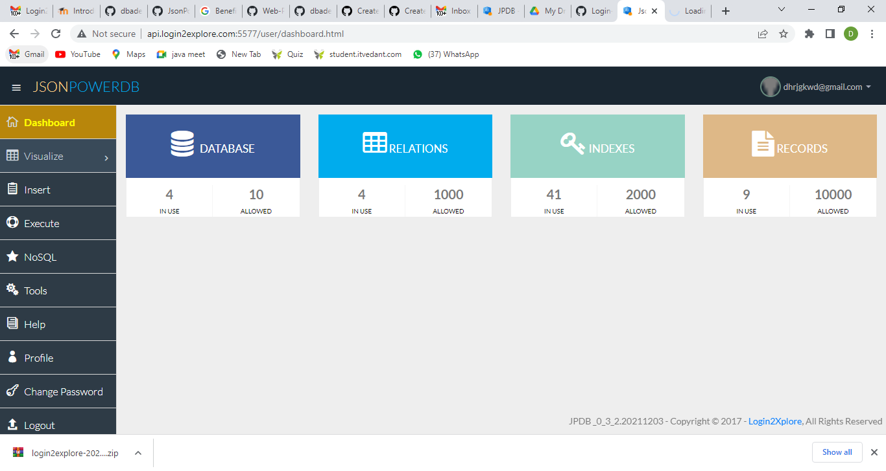

# Simply-Exploring-JSONPowerDB

### About this Repository
###### Here I have Implemented Simple Form Which Takes Input and Save it into JSONPower Database Using JavaScript, netBeans and ajax.

## About JSONPOWERDB
##### JsonPowerDB is a Real-time, High Performance, Lightweight and Simple to Use, Rest API based Multi-mode DBMS. JsonPowerDB has ready to use API for Json document DB, RDBMS, Key-value DB, GeoSpatial DB and Time Series DB functionality. JPDB supports and advocates for true serverless and pluggable API development.
## Benefits of JSONPOWER DB
##### Multiple times faster than popular DBMS. Serverless support for faster development - A UI developer can develop complete dynamic application. DBMS with built in web / application server and embedded caching makes the performance lightning fast. Server side Native NoSQL - best query performance.

### Screenshots:

